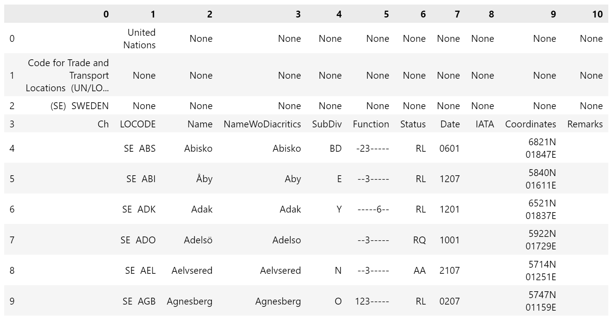
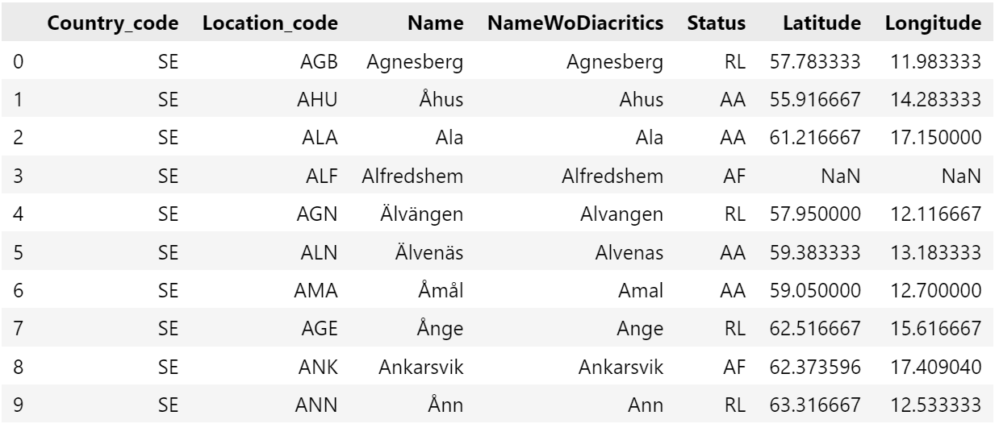
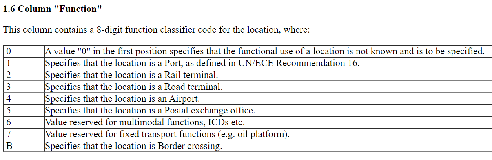
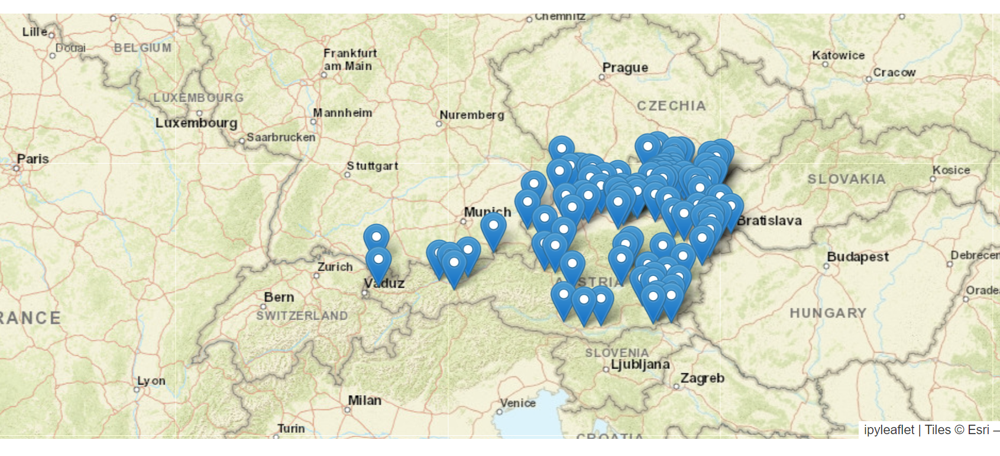

# Boat port data scraper 

Within this repo I have created a program that will scrape data from the UN/LOCODE Code List by Country and Territory website (https://unece.org/trade/uncefact/unlocode).

This contains information about the United Nations code for trade and transport locations. It includes over 103, 034 locations in 249 countries and territories. You can find more information with the link above. Here is the link to the different locations (https://unece.org/trade/cefact/unlocode-code-list-country-and-territory).

The aim of the project was to scrape the data from the website and then process it and save the processed data for future use within a database.

The program will scrape all the data from the website and save as raw data files in csv format. Then it will process the raw data files into cleaned csv files for future use. 


## The data process

This is an example of what the data looked like before processing:
<div align="center">
     
</div>

This is an example of the data after the cleaning process: 
<div align="center">
     
</div>

The cleaned data frame only contain the original "Name", "NameWoDiacritics" and "Status". I created the "Country_code" and "Location_code" from the original data frame column "LOCODE".

The original data frame contained a column called "Function". This contained numbers that would reference to what type of transport location the place has (see below). I was only interested in locations with number one within this column as these are port locations.  
<div align="center">
     
</div>


## Running the program

Clone the repo and install requirements. This program is using : ```python 3.9.18```

```bash
# clone
git@github.com:SCGlass/table_scraper.git

# activate your venv
source {YOURDEVPATH}/venv/bin/activate

# install requirements
pip install -r "requirements.txt"

```

Once all the packages have been installed you can now run the program within the linux bash console. Ensure that you are within the "src" folder 

```bash
python3 main.py
```

The command line program will prompt with instructions. First it will ask if you wish to download the raw data, if it is not present within the source folder. When you select "y" it will scrape the data tables from the website and save as individual ".csv" files within a folder named "raw_country_data" which will be within the src folder. You will then be prompted if you wish to process the raw data. You can opt out and do it later if you require to. 

If you were to return at a later data to process the data. The program will detect if the raw data is present or not and will ask to process. If you wish to process, it will save the files as ".csv" within a folder called "cleaned_port_data". 

If you were to run the program and the processed data file is present, it will detect this and end the program.

## Scripts explained

- ```src/main.py``` - This is where the program is run from. It contains the user input prompts and triggers the functions within other scripts.
- ```src/scraper.py`` - The main scraping function is within this script. It downloads the raw data and saves into a folder within the src.
- ```src/countries.py`` - This contains a dictionary that has all the countries and country codes used within the website that the data is scraped from. This can be easily adjusted for future reference.
- ``src/data.py`` - This contains a process for loading the data from the raw_country_data file before processing and also a process for saving the processed data.
- ``src/process.py`` - The cleaning process for the data frames is within this script. This cleans and created new columns. It also searches for missing coordinates by using an API from "Streetmap". 

## Other relevant files

```exploration/mapping.ipynb``` - Within this notebook is a mapping plot. This could be useful as you can check how the plotting of the port locations looks like and to see if there are any outliers (see example below("Austria))

<div align="center">
     
</div>

## What next? 

This project has been very useful as I have learnt how to process and create a manual Data pipeline.

How can I build upon this project? :
- Create a automatized pipeline, that would scrape and process the data at a scheduled time.
- Run the program within an Amazon virtual environment, so that the process would not interrupt the use of a stand alone computer.
- Create a database from the cleaned .csv files.
- Find a solution to fix any outliers within the processed data.  